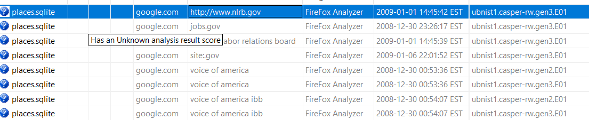
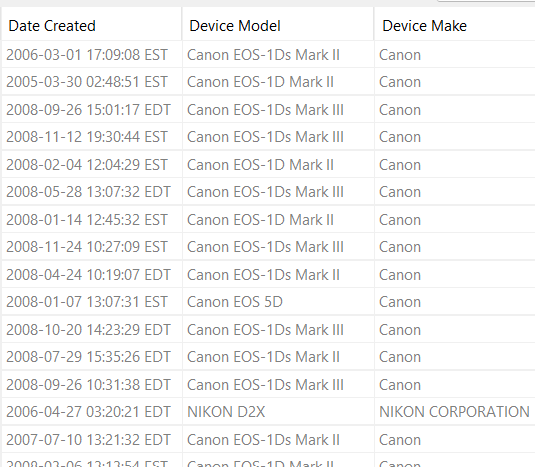

# Digital Corpora — nps-2009-casper-rw

## Executive summary
Using Autopsy 4.22.1 I examined the provided casper-rw images. This report records observations, artifacts found, and recommendations for preservation and further analysis. It avoids asserting expo[...]

## Images (evidence files)
| Image filename | MD5 checksum |
|---|---|
| ubnist.casper-rw.gen0.EO1 | 761c3476a18a87699b6b9776433d198d |
| ubnist.casper-rw.gen1.EO1 | 23a69347098ca4e611d3c9970dbed449 |
| ubnist.casper-rw.gen2.EO1 | eaf3e9d7c06ca14a52d165cd89d1282e |
| ubnist.casper-rw.gen3.EO1 | 717f6be298748ee7d6ce3e4b9ed63459 |

## Environment / system
- Analysis tool: Autopsy 4.22.1
- Observed operating system on the images: Ubuntu 8.10 (Intrepid Ibex), i386
- Note: the image did not contain a `/home/` directory.

## Methodology
1. Mounted/ingested EO1 images in Autopsy 4.22.1.
2. Performed artifact examination using Autopsy features as applicable (keyword/search, browser artifacts, file metadata review).

## Accounts & system artifacts
- Accounts discovered on the image: Avahi (UID: 110) and Ubuntu (UID: 0).
- Notable system artifacts to preserve
  - Browser profiles and history
  - `/var/log/` (system logs)
  - Relevant caches or temporary directories

## Browsing activity
- Browsing artifacts were examined.
- User had 281 web bookmarks, 27 web cookies, 59 web downloads, 414 sites browsed, and 8 searches. 

## Images & EXIF summary
- Photos were identified during analysis. An EXIF CSV export was not produced as part of this report. If desired, an EXIF export can be generated with the following fields: filename, DateTimeOrigi[...]

## Evidence (screenshots)
- Search history evidence: 
- Image metadata evidence: 

## Recommendations & next steps
1. Preserve the EO1 image files and record hashes for chain-of-custody.
2. If browser artifacts exist, export browser history with timestamps and generate checksums for the exports.
3. If required, export EXIF metadata for recovered images and generate a CSV for timeline/location correlation.
4. Consider deeper analysis for recovered deleted files and for downloads/attachments if present.

## Appendix: reproducibility & notes
- Tools used: Autopsy 4.22.1
- Data exports: list folder paths and filenames of any exported reports and provide their checksums.
- Change log:
  - Edited by Kael Butler, 2026-06-29 
